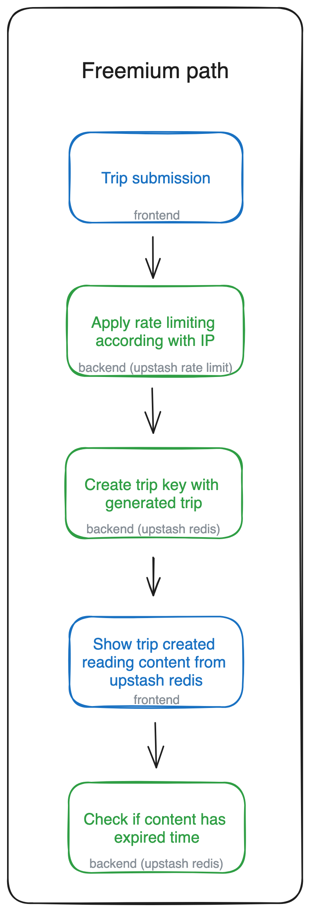

# How Upstash is Fueling PlanTripAI's Growth

In this article, I explore the pivotal role of Upstash in the development of PlanTripAI, an AI-driven trip planning startup. Utilizing Upstash Redis has been crucial for managing essential aspects like storing key licenses for user access and efficiently saving and caching trip content. Furthermore, Upstash's Rate Limit feature plays a vital role in safeguarding our system. It effectively manages request frequencies, offering robust protection against potential security threats and ensuring a smooth, uninterrupted service for our users.

> [plantripai.com](https://plantripai.com/) is an AI-based trip planner that quickly creates personalized itineraries based on user preferences such as destination, stay duration, travel style, and budget. It offers unlimited itinerary creation and various download formats.

## Tools

- [@upstash/redis](https://github.com/upstash/upstash-redis)
- [@upstash/ratelimit](https://github.com/upstash/ratelimit)
- [next.js](https://github.com/vercel/next.js)

## How it works

AI companies typically offer multiple ways for users to try their products. At PlanTripAI, we provide both a freemium and a paid plan.

In our freemium, and most popular plan: Each time a user creates a trip without a valid license, a new random key is generated and stored in a Redis hash `(redis.hset(trip:${key}, data))`, along with the trip content. This key grants temporary access to the trip's details page. Once this access expires, the user can decide whether to maintain permanent access to the trip or not.

Additionally, freemium users are subject to a rate limit (`fixedWindow`) of 3 requests per 10 seconds, which helps prevent potential attacks on the application.



Regarding the paid plan, users can purchase the product through a payment gateway. Upon successful transaction, the payment gateway's webhook emits a success event, and a key is stored in Redis as a valid key `(redis.set(${licenseKey}, true))`.

When a user with a valid license creates a trip, a random key is still generated and stored in Redis. Additionally, the new trip is stored in their user object and linked with their license key.

Paid users enjoy a more generous rate limit than freemium users. This enhanced feature is dynamically provided by checking for a valid key in Redis.


## Storing the Trip Data

PlanTripAI leverages Redis to store user-created trips. Redis is an ideal choice for us because of its efficiency as a fast key-value store. Given that the trips, once created, are immutable, and the use of hashes enables us to store metadata alongside the key data.

The trip data is structured in a Redis hash as follows:

```js
{
    "itinerary": [
        { "day": "Day 1", "data": [...] }
    ],
    "info": "This itinerary is designed for a city explorer visiting Paris, France for 2 days.",
    "inputs": {
        "city": "Paris, France",
        "days": 2,
        "accommodation": "Paris France Hotel",
        "kind": "city explorer",
        "currency": "USD",
        "budget": 3000,
        "transportation": "bus"
    },
    "createdAt": ...,
    "shareable": false
}
```

Using the [Upstash Redis API over HTTP](https://upstash.com/docs/redis/features/restapi), the data is stored in the free Redis database, which offers 10,000 requests per day for free, more than sufficient for our needs.

```js
import { Redis } from "@upstash/redis";

const redis = new Redis({
  url: "..." // UPSTASH_REDIS_REST_URL
  token: "..." // UPSTASH_REDIS_REST_TOKEN
});

redis.hset(`trip:${id}`, data);
```

## Storing Valid License Keys

As previously mentioned, one way to access all features of PlanTripAI is through a paid subscription, where each paid user is assigned a valid license key stored in Redis. This setup is ideal for quick validation checks, given Redis's efficiency as a key-value database.

To mark a user as valid, we execute the following command:

```js
import { Redis } from "@upstash/redis";

const redis = new Redis({
  url: "..." // UPSTASH_REDIS_REST_URL
  token: "..." // UPSTASH_REDIS_REST_TOKEN
});

await redis.set(licenseKey, true);
```

To verify a user's validity, we use this command:

```js
import { Redis } from "@upstash/redis";

const redis = new Redis({
  url: "..." // UPSTASH_REDIS_REST_URL
  token: "..." // UPSTASH_REDIS_REST_TOKEN
});

const redisLicenseKey = await redis.get(licenseKey);
const valid = Boolean(redisLicenseKey);

if (!valid) {
  return new Response(
    JSON.stringify({ message: "The license key is invalid!" }),
    {
      status: 401,
    }
  );
}

// successful code here...

```

## Implementing Rate Limits

A key feature in safeguarding our application is the rate limit logic, supported by [Upstash Rate Limit](https://github.com/upstash/ratelimit). More information can be found [here](https://upstash.com/blog/ratelimit-dashboard). This service is crucial for maintaining a seamless experience for both free and paid users, having successfully thwarted attacks from malicious users without impacting the overall application.

Below is a code snippet using [next.js](https://nextjs.org/blog/next-13) as a [middleware](https://nextjs.org/docs/app/building-your-application/routing/middleware). This code helps manage user IP checks and decides whether to proceed with subsequent requests.

```js
import {
  NextResponse,
  type NextFetchEvent,
  type NextRequest,
} from "next/server";
import { Ratelimit } from "@upstash/ratelimit";
import { Redis } from "@upstash/redis";

const cache = new Map();
const ratelimit = new Ratelimit({
  redis: Redis.fromEnv(),
  limiter: Ratelimit.fixedWindow(3, "10s"),
  ephemeralCache: cache,
  analytics: true,
});

export default async function middleware(
  request: NextRequest,
  event: NextFetchEvent
): Promise<Response | undefined> {
  const id = request.ip ?? "anonymous";

  // optional hard coded IPs
  const blockeds = [];
  if (blockeds.includes(id.trim())) {
    new NextResponse(
      JSON.stringify({
        message: "Blocked :)",
      }),
      { status: 429, headers: { "Content-Type": "application/json" } }
    );
  }

  const { success, pending, limit, reset, remaining } = await ratelimit.limit(
    id
  );
  event.waitUntil(pending);

  request.headers.set("X-RateLimit-Limit", limit.toString());
  request.headers.set("X-RateLimit-Remaining", remaining.toString());
  request.headers.set("X-RateLimit-Reset", reset.toString());

  return success
    ? NextResponse.next()
    : new NextResponse(
        JSON.stringify({
          message:
            "Request cannot be processed! You sent too many requests in a given amount of time.",
        }),
        { status: 429, headers: { "Content-Type": "application/json" } }
      );
}

export const config = {
  matcher: ["/api/generate-trip", "/api/get-license/(.*)"],
};
```

## Final words

Thank you for taking the time to read! PlanTripAI began as a side project, born from my curiosity about integrating Upstash Redis with Next.js in a SaaS framework.

I sincerely hope you found this informative and insightful. Your questions or feedback are highly appreciated. Feel free to connect with me on [Twitter](https://twitter.com/murillodmiranda) for any queries or comments.
